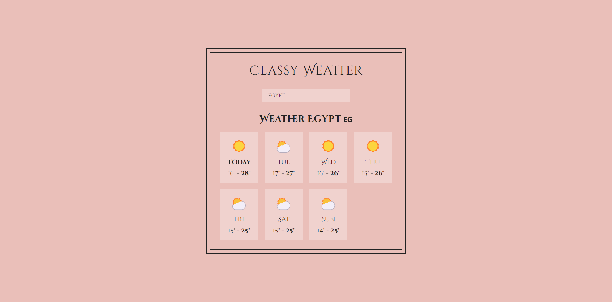

# Classy Weather React App

## Project Description 📄

The Classy Weather App is a small project created to practice using old-school class components in React. It fetches weather data from an external API based on the user’s location input and displays the weather forecast for the upcoming days. This project emphasizes the use of class components over function components.

## Features ✨

- **Search Location 🌍**: Search for any location to get the weather forecast.
- **Weather Icons ⛅**: Display weather icons based on weather conditions.
- **Location Storage 📍**: Save and retrieve the last searched location from local storage.
- **Loading Indicator ⏳**: Show a loading indicator while fetching data.

## Technologies and Libraries Used 🛠️

- **React ⚛️**: For building the user interface using class components.
- **JavaScript 💻**: For handling logic and data manipulation.
- **Fetch API 🌐**: For making API calls to get weather data.
- **Local Storage 💾**: For persisting the last searched location.
- **Open Meteo API ☁️**: For fetching weather data.
- **CSS 🎨**: For styling the app.

## Live Demo 🌐

Check out the live demo: [https://classy-weather-mo3bassias-projects.vercel.app](https://classy-weather-mo3bassias-projects.vercel.app)

## Feedback and Contributions 🤝

I would greatly appreciate any feedback. Feel free to open issues or submit pull requests to improve this project.
